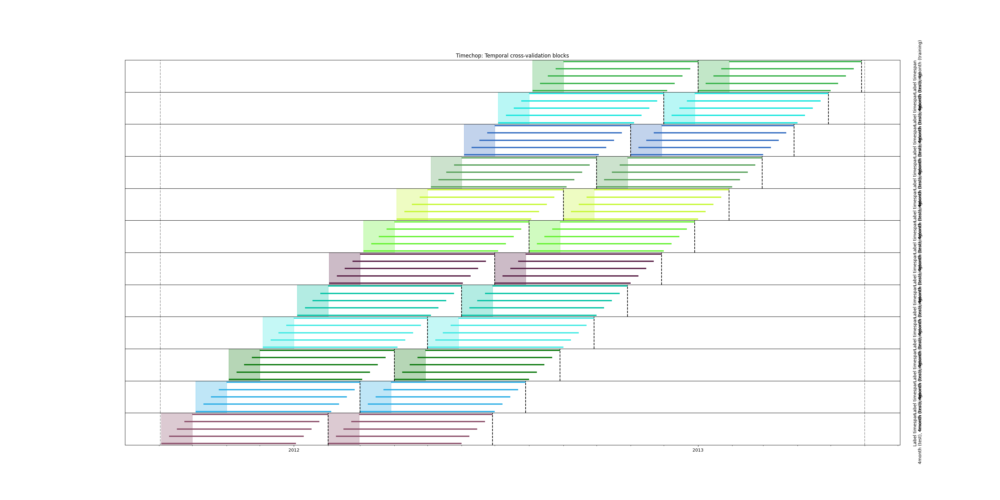
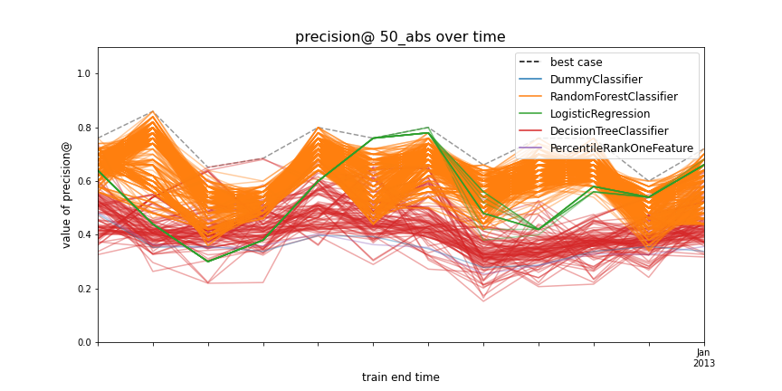
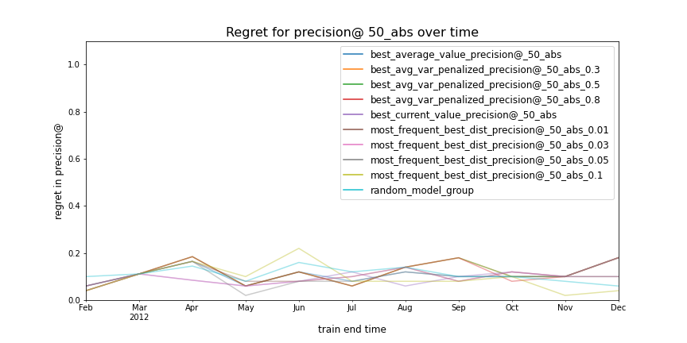

## Running this project

### Setup

1. Configure a postgres database with the [KDD Cup 2014 DonorsChoose dataset](https://www.kaggle.com/c/kdd-cup-2014-predicting-excitement-at-donors-choose/data), using the tables `donations.csv`, `essays.csv`, `projects.csv`, and `resources.csv`

> Note: Kaggle hosts a [more recent DonorsChoose dataset](https://www.kaggle.com/donorschoose/io), which goes through May 2018. It includes similar data, but in a slightly different schema.

2. Create a new python environment and install python prerequisites from requirements.txt:

        `pip install -r requirements.txt`
3. Run each of the sql files in precompute_queries against your database, starting with create_optimized_tables. These queries improve databse performance and generate several aggregated features.
4. Create a [database.yaml file](https://github.com/dssg/triage/blob/master/example/database.yaml) with your credentials.

### How to use

1. Run [main.py](main.py). This will run the Triage experiment defined in [donors-choose-config.yaml](donors-choose-config.yaml).
2. Run [model_selection.ipynb](model_selection.ipynb). Be sure to update experiment_id to match the experiment hash generated by step 1.

## Introduction

### DonorsChoose

[DonorsChoose](https://www.donorschoose.org/) is a nonprofit that addresses the education funding gap through crowdfunding. Since 2000, they have facilitated $970 million in donations to 40 million students in the United States.

However, approximately one third of all projects posted on DonorsChoose do not reach their funding goal within four months of posting.

This project will help DonorsChoose shrink the education funding gap by ensuring that more projects reach their funding goals. We will create an early warning system that identifies newly-posted projects that are likely to fail to meet their funding goals, allowing DonorsChoose to target those projects with an intervention such as a donation matching grant.

### The DonorsChoose Database

We use four tables from the DonorsChoose database:

| Name          | Description                                                                                                                                                | Primary Key | Used? |
|---------------|------------------------------------------------------------------------------------------------------------------------------------------------------------|-------------|-------|
| **projects**  | Basic metadata including teacher, class, and school information, and project asking price.                                                                 | projectid   | yes   |
| **resources** | Information about the classroom supply or tool the classroom is seeking funding for. Product category, per-unit price, quantity requested, etc.            | projectid   | yes   |
| **essays**    | Stores text of funding request.                                                                                                                            | projectid   | yes   |
| **donations** | Table of donations. Donor information, donation amount, messages from donors. Zero to many rows per project.| donationid  | yes   |

## Initial Processing

We performed some initial processing of the source database to improve database performance and ensure compliance with Triage. These changes are stored in a copy of the source schema, called optimized.

### Renaming projectid to entity_id

Triage expects each feature and label row to be identified by a primary key called entity_id. For convenience, we renamed projectid (our entity primary key) to entity_id.

### Integer entity ids

We replaced the source database's string (postgres varchar(32)) projectid key with integer keys. Triage [requires integer entityids](https://dssg.github.io/triage/experiments/cohort-labels/#note-2), and integer keys will improve performance on joins and group operations.

### Primary & Foreign Key constraints

We create primary key constraints on projectid in all tables (and a foreign key constraint on donations.projectid). This improves performance by creating indexes on each of those columns.

## Problem Framing

Let's start by stating our qualitative understanding of the problem. Then, we'll translate that into a formal problem framing, using the language of the Triage experiment config file.

### Qualitative Framing

Once a DonorsChoose project has been posted, it can recieve donations for four months. If it doesn't reach its funding goal by then, it is considered unfunded.

DonorsChoose wants to institute a program where a group of projects at risk of falling short on funding are selected to recieve extra support: enrollment in a matching grant program funded by DonorsChoose's corporate partners, and prominent placement on the DonorsChoose project discovery page.

These interventions have limited capacity: funding is limited, and only a few projects at a time can really benefit from extra promotion on the homepage. Each day, DonorsChoose chooses a few newly-posted projects to be enrolled in these interventions, based on information in their application for funding. Each month, 50 projects in total are enrolled in the interventions.

Therefore, our goal is to identify a machine learning model that identifies the 50 projects posted each month that are most likely to fail to reach their funding goal.

### Triage Framing

#### Temporal Config

##### Start & end times


DonorsChoose project applications grew significantly during 2010 and 2011. We select a dataset starting in mid-2011, after this period of growth, and running through the end of 2013, the last compete year of data.

```
feature_start_time: '2011-09-02'
label_start_time: '2011-09-02'

feature_end_time: '2013-06-01'
label_end_time: '2013-06-01'
```

> Starting with September 1, 2011 causes Triage to generate a useless 13th training set containing a single day's worth of projects. We start our data on September 2nd to avoid this.

##### Model update frequency
Each month, the previous month's data becomes availabe for training a new model. 

`model_update_frequency: '1month'`

##### Test set duration

Our model will make predictions once a month, on the previous month's unlabeled data. Our one month test set length reflects this.

`test_durations:['1month']`

##### Training history

Patterns in the DonorsChoose data can change significantly within a year. We use one-month training sets ensuring that our models are trained on recent data, and capture recent trends.

`max_training_histories: ['1month']`

##### As of date frequencies

When the model is in production, DonorsChoose will evaluate new projects daily. We use a 1 day as of date frequency to simulate the rate at which DonorsChoose will evaluate the model's predictions.

```
training_as_of_date_frequencies: ['1day']
test_as_of_date_frequencies: ['1day']
```

##### Label timespan

An proejct's label timespan is the amount of time that must pass from when a project is posted, to when its label can be determined. In our case, each project has a four month label timespan.

```
training_label_timespans: ['4month']
test_label_timespans: ['4month']
```

Here's our temporal config in a timechop diagram:



Triage builds a 13th train/test set with data from just a few as_of_dates in September 2011 - we'll ignore models from that set in model selection.

#### Outcome

Under our framing, each project can have one of two outcomes:

- **Fully funded**: Total donations in the four months following posting were equal to or greater than the requested amount
- **Not fully funded**: Total donations in the four months following posting were less than the requested amount.

We generate our label with a query that sums total donations to each project, and calculates a binary variable representing whether the project went unfunded (`1`) or met its goal (`0`).

Our query is parameterized by triage over `label_timespan` (in our case, always four months) and `as_of_date` (used here to select all the projects posted on a given `as_of_date`).

#### Metric

Since our intervention is resource-constrained and limited to 50 projects each month, we are concerned with minimizing false positives. We optimize our models for precision at top 50.

## Feature Generation

We implement two categories of features. The first are features that we read directly from the database, raw, or with only transformations. These include project metadata such as teacher and student demographic information, category and price of requested resource, essay length, and other variables.

These features can be generated exclusively within triage, without performing any manual transforms within the database.

The second category of features are temporal aggregations of historical donation information. These answer questions like "how did a posting teacher's previous projects perform?" and "how did previous projects at the originating school perform?"

_Specifically, these features calculate funding rate (rate of successful projects) and average total donations over the 1 or 2 years prior to posting, within the same school district or zip, or from the same teacher as a project in question. (revise)_

These aggregations would be too complex to perform with Triage's feature aggregation system. So we wrote a series of sql queries to generate these feature manually, and stored them in a table called `time_series_features`.

The DDL statements that create these features are stored in [precompute_queries](precompute_queries)

## Modeling

### Model Grid

Our model grid includes three model function candidates, and three baseline sources.

Model function candidates:
- sklearn.ensemble.RandomForestClassifier
- sklearn.linear_model.LogisticRegression
- sklearn.tree.DecisionTreeClassifier

Baslines:
- sklearn.tree.DecisionTreeClassifier (max_depth = 2)
- sklearn.dummy.DummyClassifier (predicting our label's base rate)
- triage's PercentileRankeOneFeature, which ranks entities based on a single feature.

### Model Selection



We use Auditioner to manage model selection. Plotting precision@50_abs over time shows that our models are generally performing well - most models perform better than baselines (sklearn's DummyClassifier predicting the label's prevalence for all projects, and a 2-depth decision tree).

Our logistic regression model groups tend to perform worse than our random forests. The diference in performance (as much as .25) doesn't justify a tradeoff for the models' potential higher interpretability.


We use Auditioner to perform some coarse filtering, eliminating the worst-performing model groups:
- Dropping model groups that achieved precision@50 worse than 0.5 in at least one test set
- Dropping model groups that had a regret (difference in performance from the best-performing model group) of 0.2 or greater during at least one month

Performance in the resulting set of model groups ranges from ~0.5 to 0.8, well above the prior rate of ~0.3. Looking pretty good so far.


Building a basic Auditioner model selection grid, it looks like variance-penalized average precision (penalty = 0.5) and best current precision minimize regret.

|Criteria|Average regret (precision @ 50_abs)|
|-|-|
|Variance-penalized average precision (0.5)|0.0819|
|Best current precision | 0.0789|
|Most frequently within .03 of best | 0.0909|



Variance-penalized average precision seems like a safe choice. It performs only slightly worse than the best criteria, and allows us to ignore models that perform inconsistently.

This criteria selects three random forest model groups for the next period:

|                                         | max_depth | max_features | n_estimators | min_samples_split |
|-----------------------------------------|-----------|--------------|--------------|-------------------|
| RandomForestClassifier | 10        | 12           | 10000        | 50                |
| RandomForestClassifier | 10        | auto         | 5000         | 25                |
| RandomForestClassifier | 10        | log2         | 1000         | 25                |